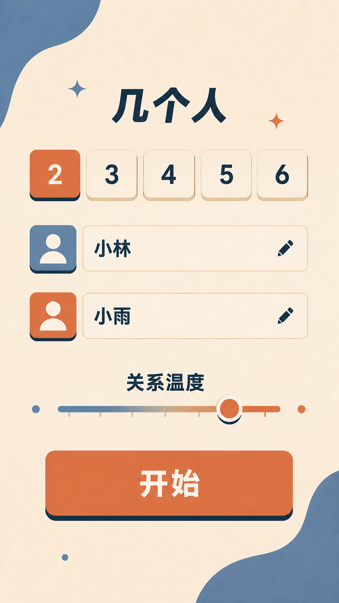
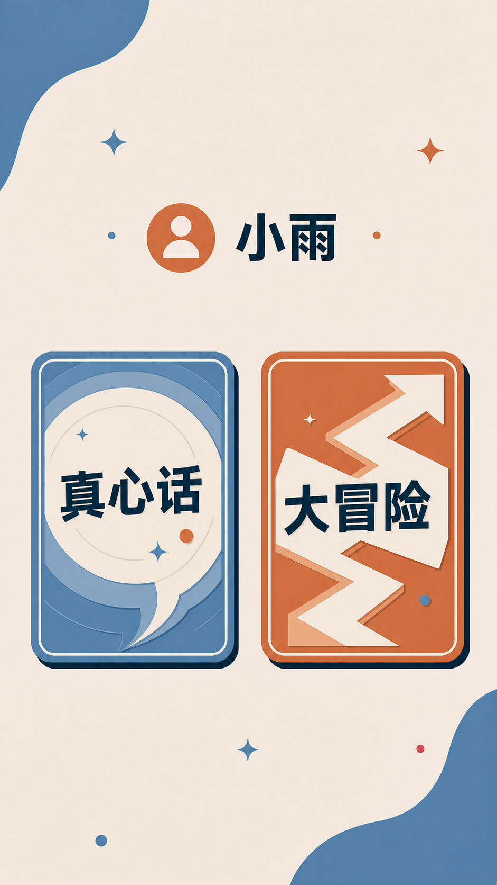
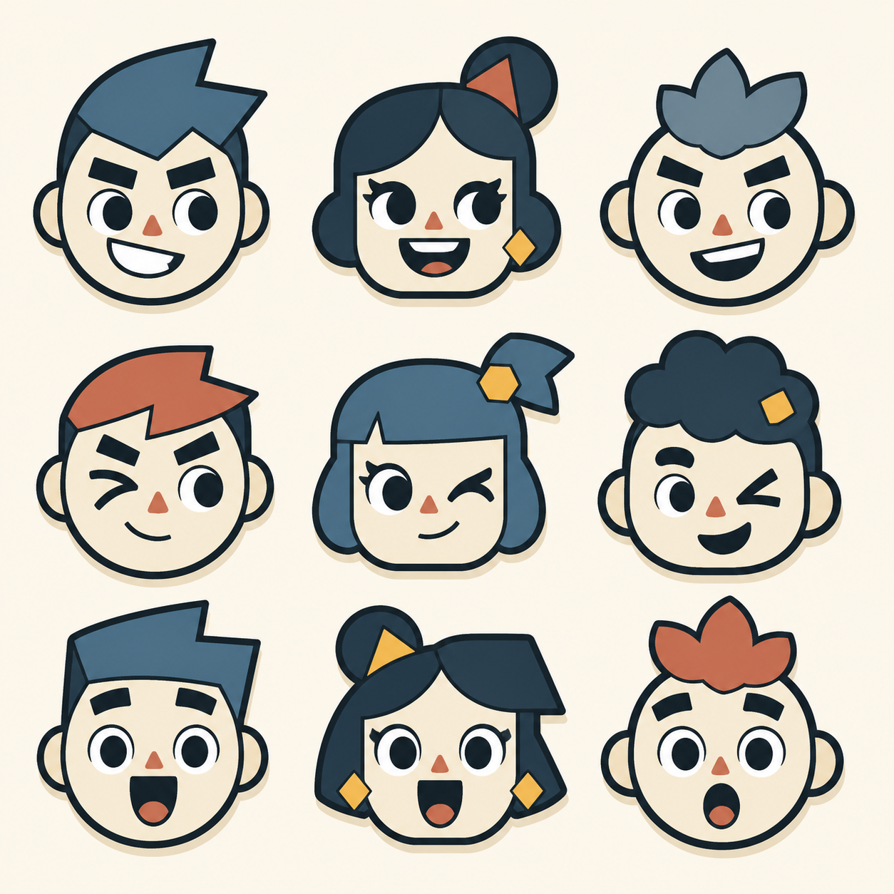
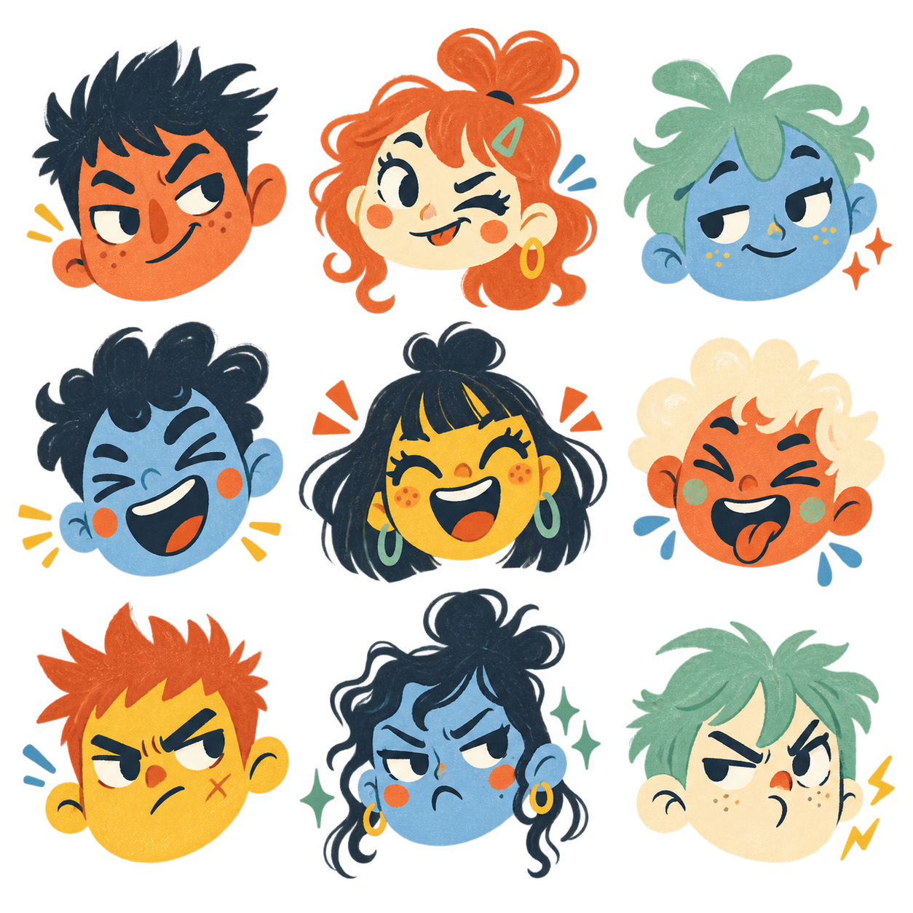

# 「干杯！」项目总结与 UI 设计交接

> 更新时间：2026-08-22  
> 文档用途：交给新的对话继续设计手机端 App UI。本文是当前产品与视觉决策的唯一交接入口。

## 1. 产品概述

「干杯！」是一款以面对面交流为核心的 AI 真心话大冒险手机游戏。

产品不是聊天软件，也不是让用户持续操作手机的复杂应用。手机只负责：

- 创建本局游戏；
- 随机选择玩家；
- 让被选中的玩家选择真心话或大冒险；
- 展示 AI 生成的题目；
- 进入下一轮。

用户真正的注意力应留在现实中的人和对话上。

## 2. 核心使用场景

- 主要场景：双人，尤其是一男一女面对面游戏；
- 同时支持三人及多人聚会；
- 人数会直接改变玩家卡片布局、题型和互动结构；
- 手机可能平放或立放在桌面上，因此昵称、选中结果和题目必须远距离可读；
- 使用环境可能较暗，但当前视觉方向选择舒适的浅色背景，而不是夜店式深色界面。

## 3. MVP 功能边界

### 第一版包含

1. 选择人数；
2. 输入玩家昵称；
3. 设置玩家性别：男、女、不透露；
4. 使用滑动条设置整体关系温度；
5. 根据人数自适应显示玩家卡片；
6. 使用“跳灯”动画随机选择玩家；
7. 被选中者选择真心话或大冒险；
8. 展示对应题目；
9. 刷新当前类型的题目；
10. 点击题目卡返回玩家跳灯界面，开始下一轮。

### 第一版不包含

- 环境语音监听或语音转文字；
- 保存玩家回答；
- 复杂关系图谱；
- 每位玩家设置禁区；
- 登录、付费、社区；
- 长期记忆；
- 让玩家点击其他人的头像来记录现场答案。

语音旁听存在嘈杂环境、多人声纹、错误归属和隐私授权等问题，只考虑后续迭代。

## 4. 已确认的交互流程

```text
开屏“干杯！”
→ 创建游戏
→ 选择人数
→ 输入昵称和性别
→ 调节关系温度
→ 进入玩家卡片界面
→ 跳灯随机选择玩家
→ 被选中者选择真心话或大冒险
→ 展示题目
→ 点击刷新图标更换同类型题目
→ 点击整张题目卡返回玩家界面
→ 下一轮
```

### 关键交互规则

- 跳灯开始前先确定随机结果，动画只负责表现过程；
- 可采用受控随机，避免某一玩家连续多次被选中；
- 跳灯频率先快后慢；
- 选中玩家后才显示真心话/大冒险选择；
- 选择类型后才展示题目；
- 题目页不设置“完成”按钮；
- 点击整张题目卡即完成本轮并返回跳灯界面；
- 换题使用居中的圆形刷新图标，不显示“换一题”文字按钮。

## 5. 人数与布局原则

- 2 人：双卡片布局，是最重要的体验；
- 3 人：可使用三角结构，但不要产生办公通讯录感；
- 4 人：稳定的 2×2 网格；
- 5～6 人：紧凑网格，所有玩家尽量在一屏内可见；
- 玩家数量多时缩小卡片装饰，而不是缩小昵称到不可读；
- 跳灯过程中所有玩家的位置保持稳定；
- 不使用必须横向滚动的玩家列表，因为跳灯不能停在屏幕外。

## 6. 关系温度

关系不使用“朋友、暧昧、情侣”等标签定义，因为真实关系可能模糊且双方理解不一致。

开局使用连续滑动条表达整体关系程度：

- 双人文案语义：你们有多靠近；
- 多人文案语义：这桌人有多熟；
- 后台可转换为 0～100 的连续值；
- 不显示精确数字；
- 不使用雪花、火焰、爱心、破碎爱心等具有倾向性的端点图标；
- 当前确定为蓝色圆点、橙色圆点及蓝橙连续色带。

关系温度主要控制题目的私密程度和直接程度，不代表任何身体接触许可。

## 7. AI 题目生成逻辑

人数是题型结构参数，关系温度是题目尺度参数。

```text
人数 → 决定双人对话、三人互动、多人选择或群体玩法
关系温度 → 决定破冰、熟悉、试探、深入程度
当前轮次 → 决定节奏推进
换题记录 → 作为弱负反馈
```

双人题目必须使用“你、对方、你们”，不能出现没有选择意义的“在场选一个人”。

题目应提前生成并进入缓冲池：

```text
进入游戏 → 预生成真心话和大冒险候选题
点击类型 → 立即显示缓存题目
消耗题目 → 后台异步补充
```

AI 只返回结构化内容，不能生成页面 HTML 或决定卡片样式。

## 8. 手机端标准

最终产品是 iOS 与 Android 手机 App，不是网页产品。现有 HTML 仅用于验证交互状态。

建议设计基准：

- iOS：393 × 852 pt；
- Android：360 × 800 dp；
- 保留顶部安全区与底部手势安全区；
- 所有触控区域不小于 44 × 44 pt；
- 不依赖鼠标悬停；
- 题目字号应适合手机放在桌面上阅读；
- 所有视觉稿必须是 App 界面，不是海报、营销页或带手机外壳的展示图。

## 9. 当前视觉方向

### 色彩

```text
暖奶油白  #F7F0E5  主背景
雾霾蓝    #6286A0  安静、稳定、真心话
陶土橙    #D87858  行动、强调、大冒险
深灰蓝    #25343D  文字、结构、硬边阴影
```

建议面积比例：

```text
奶油白 60%
雾霾蓝 20%
陶土橙 10%
深灰蓝 10%
```

舒适配色不等于商务配色。默认状态可以舒适，但跳灯和选中瞬间需要提高饱和度、位移和节奏感。

### 形状和材质

- 现代实体桌游卡牌感；
- 少量大面积背景曲线；
- 中等圆角；
- 深灰蓝硬边错位阴影；
- 图形应能用原生组件、CSS 或 SVG 重建；
- 不使用黑紫毛玻璃；
- 不使用大面积霓虹光；
- 不使用无意义英文和微小装饰文字；
- 避免把所有内容都放进独立圆角容器。

### 字体方向

- 粗体、清晰、现代中文黑体；
- 可考虑思源黑体 Heavy、阿里巴巴普惠体 Heavy；
- 昵称与题目文字必须成为视觉主角；
- 不使用装饰英文作为高级感来源。

## 10. 人物头像结论

人物头像应根据玩家性别选择基础轮廓，但不能成为写实证件照或办公软件头像。

已确认保留三个方向：

1. 几何游戏币；
2. 手绘表情贴纸；
3. 现代卡牌脸谱。

头像设计原则：

- 男、女、中性使用不同基础轮廓；
- 性别通过脸型和发型等细节表达；
- 不使用“蓝男粉女”；
- 不出现衬衫、西装、卫衣等办公或生活半身像；
- 头像应像游戏角色牌或游戏筹码；
- 表情可以根据玩家随机分配；
- 正式产品应将选中的方向重绘为 SVG 组件，而不是直接裁切生成图片。

## 11. 当前候选 UI 素材

这些图片是视觉参考，不是最终布局稿，也不能直接作为 App 背景使用。

### 开屏：产品名已修改为“干杯！”


### 创建游戏：关系温度使用中性端点



### 双人跳灯：仅作为卡片和灯光状态参考


### 模式选择：两张卡并列并拥有不同图形性格



### 题目页：刷新按钮居中，点击整卡返回


## 12. 保留的头像素材

### A. 几何游戏币



特点：实现成本低、SVG 化容易，但需要避免过于常规。

### B. 手绘表情贴纸



特点：人物性格和游戏感最强，适合作为主要探索方向。

### C. 现代卡牌脸谱


特点：更克制成熟，适合偏实体桌游的品牌方向。

## 13. 已否决或需要避免的方向

- 黑紫渐变、毛玻璃和英文装饰字组成的泛 AI 产品风格；
- 直接照搬蓝色＋粉色参考产品；
- 高饱和橙色＋紫色铺满全屏，视觉疲劳过强；
- 写实或半写实人物半身像；
- 企业通讯录、人员管理、办公软件式玩家卡片；
- 三个大方框机械地纵向排列；
- 题目页同时放“换一题”和“完成”两个大按钮；
- 关系温度两端使用雪花、火焰、爱心、破碎爱心；
- 为获取关系数据要求用户点击其他玩家头像；
- 用 ImageGen 生成整张界面后直接贴到产品里。

历史和否决素材统一放在：`docs/assets/archive/`。它们仅用于理解迭代过程，不应作为下一轮设计依据。

## 14. 当前原型代码状态

项目内已有一个 React/Vinext HTML 交互原型，可运行以下流程：

- 人数、昵称、性别、关系温度；
- 玩家卡片；
- 跳灯随机；
- 真心话/大冒险选择；
- 题目和换题；
- 下一轮。

但现有原型的视觉设计已被否决。下一段对话可以参考其状态逻辑，不能继承其黑紫视觉。

主要文件：

- `app/page.tsx`：交互与状态；
- `app/globals.css`：旧视觉样式，不应作为新设计基础。

## 15. 下一段 UI 对话的建议任务

建议按照以下顺序继续：

1. 从 A、B、C 三种头像中确定主方向，或明确混合规则；
2. 先设计一张真正具有游戏感的双人跳灯界面；
3. 将玩家卡片从“个人资料卡”改为“游戏角色牌”；
4. 将底部普通长按钮改造成明确的游戏启动控件；
5. 完成 2 人、3 人、4 人、6 人布局；
6. 完成真心话和大冒险两种题目卡；
7. 设计跳灯经过、减速、最终选中、卡片按压和返回动画；
8. 用真实移动端安全区和触控尺寸检查所有页面；
9. 视觉确认后再转成 React Native、Flutter 或其他手机端原生组件。

## 16. 给新对话的简短提示词

可以把以下内容与本文一起交给新的对话：

> 继续为手机 App「干杯！」设计 UI。请先完整阅读 `docs/PROJECT_HANDOFF.md`，严格继承其中已确认的产品流程、交互规则、配色和否决项。当前重点不是增加功能，而是建立真正具有派对游戏感的玩家卡片、跳灯界面和人物头像系统。不要把界面设计成办公通讯录、网页或营销海报。每次生成前说明本次验证的单一设计问题。

